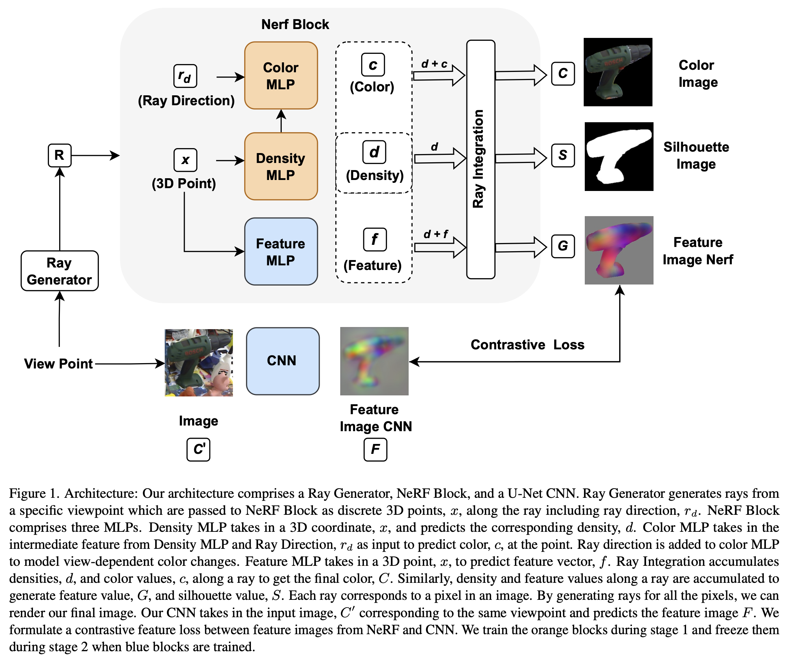
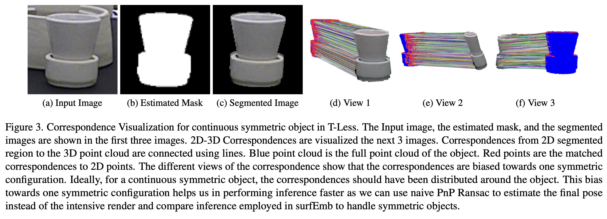

# NeRF-Feat: 6D Object Pose Estimation using Feature Rendering

**3DV 2024** | [arXiv](https://arxiv.org/abs/2406.13796) | [IEEE](https://doi.org/10.1109/3DV62453.2024.00092)

NeRF-Feat estimates the 6D pose of objects without requiring a CAD model. A NeRF is first trained on a small set of posed RGB images to implicitly reconstruct the object's geometry. A CNN is then trained jointly with the NeRF using contrastive loss, producing view-invariant 2D features that align with the NeRF's implicit 3D surface. At inference, correspondences between CNN features and the NeRF's surface are established and solved with PnP-RANSAC.



The method handles symmetric objects naturally — the contrastive objective encourages features to be consistent across symmetrically equivalent views rather than treating them as ambiguous.



---

## Setup

```bash
pip install -r requirements.txt
```

Download the [BOP Linemod](https://bop.felk.cvut.cz/datasets/) assets and place them under `bop/lm`:

```text
bop/lm/
  models/
    models_info.json
  train/
    000001/
      rgb/
      depth/
      mask_visib/
      scene_gt.json
      scene_camera.json
```

Set environment variables to avoid repeating paths on every command:

```bash
export NERFFEAT_DATASET_ROOT=/path/to/bop/lm
export NERFFEAT_OUTPUT_ROOT=/path/to/lm_out
export NERFFEAT_COCO_ROOT=/path/to/coco/train2017
export NERFFEAT_MASK_ROOT=/path/to/segmentation_mask
```

## Pipeline

### 1. Create a train/eval split

Randomly select training frames and save their IDs. The rest are held out for evaluation.

```bash
python split_dataset.py --config configs/lm.yaml --object-id 1 --train-count 200
```

### 2. Train the NeRF

```bash
python train_nerf.py --config configs/lm.yaml --object-id 1
```

### 3. Generate surface correspondences

```bash
python generate_correspondences.py --config configs/lm.yaml --object-id 1
```

### 4. Train the pose encoder

Requires COCO background images for augmentation (optional but recommended).

```bash
python train_pose.py --config configs/lm.yaml --object-id 1
```

Resume an interrupted run with `--resume true`.

### 5. Export surface features

```bash
python export_features.py --config configs/lm.yaml --object-id 1
```

### 6. Run inference

Evaluation frames are those not in the split file. Predicted segmentation masks (e.g. from DPODv2) are loaded from `segmentation_mask/lm/scene{object_id}/` and fall back to GT `mask_visib` when absent.

```bash
python inference.py --config configs/lm.yaml --object-id 1
```

To save poses in [BOP results format](https://bop.felk.cvut.cz/challenges/):

```bash
python inference.py --config configs/lm.yaml --object-id 1 --output-csv results/nerffeat_lm-test.csv
```

To run all objects at once:

```bash
./run_pipeline.sh                              # all 15 LM objects
./run_pipeline.sh 1 5 10                       # specific objects
./run_pipeline.sh --config configs/tless.yaml  # T-LESS
```

## Datasets

| Config | Dataset | Notes |
|--------|---------|-------|
| `configs/lm.yaml` | Linemod (LM) | 15 objects |
| `configs/lmo.yaml` | Linemod-Occlusion (LM-O) | inference only, reuses LM models |
| `configs/tless.yaml` | T-LESS | 30 objects, uses all training frames |

## Artifact layout

```text
lm_out/
  objects/
    1/
      radiance_field/
        checkpoints/   coarse_field_latest.pt, fine_field_latest.pt
        meshes/        coarse_mesh_latest.ply, fine_mesh_latest.ply
      correspondences/
        cache/         surface_points/, surface_ray_xys/
      pose_encoder/
        checkpoints/   feature_field_latest.pt, rgb_encoder_latest.pt
        features/      surface_points.npy, surface_features.npy
```

## Citation

```bibtex
@inproceedings{vutukur2024nerffeat,
  title     = {NeRF-Feat: 6D Object Pose Estimation using Feature Rendering},
  author    = {Vutukur, Shishir Reddy and Brock, Heike and Busam, Benjamin and
               Birdal, Tolga and Hutter, Andreas and Ilic, Slobodan},
  booktitle = {International Conference on 3D Vision (3DV)},
  year      = {2024},
  doi       = {10.1109/3DV62453.2024.00092}
}
```
